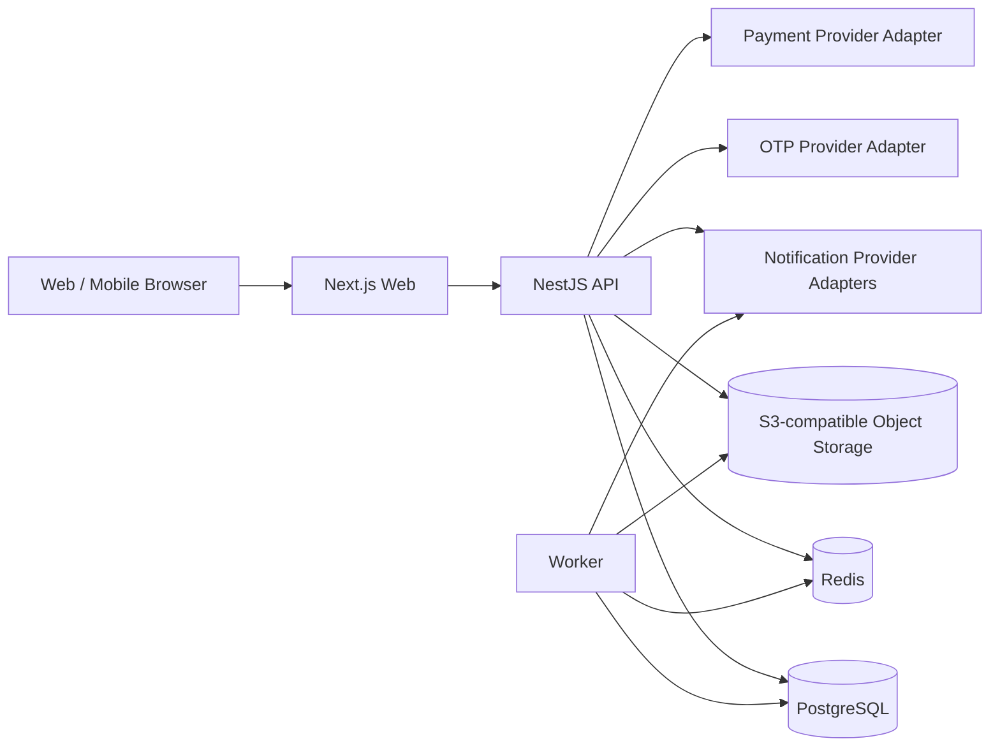

# Phase 1 Technical Architecture

Status: **Accepted baseline for implementation**

This document translates the locked Product/UX architecture into an implementation architecture. It does not change product ownership, financial rules, permissions, or unresolved product decisions.

## 1. Architecture goals

The Phase 1 system must:

- implement all current portals from one coherent platform
- preserve strict role and organization isolation
- keep shared business objects consistent across portals
- support Persian RTL and Export Partner localization
- keep financial, fulfillment, delivery, issue, and settlement states separate
- support multi-Artist Corporate and Export allocations
- remain simple enough for a small implementation team while leaving clear seams for later scaling
- avoid hardcoding unresolved FX, legal, dispute, or settlement rules

## 2. Implementation baseline

### Repository

Use a TypeScript monorepo:

- package manager: **pnpm**
- task/build orchestration: **Turborepo**
- applications and shared packages live in the same repository
- versions are pinned at Sprint 0 to current stable releases

### Applications

```text
apps/
  web/          Next.js web application
  api/          NestJS API application
  worker/       background jobs / async processing

packages/
  ui/           shared Negarin design-system implementation
  contracts/    API schemas, DTO contracts, shared enums
  domain/       domain types/value objects without framework dependencies
  authz/        reusable authorization policies and scope helpers
  i18n/         locale messages and formatting helpers
  config/       typed configuration and environment validation
  observability/ logging/tracing helpers
  test-utils/   shared fixtures and test factories
```

### Frontend

**Next.js + React + TypeScript**, web-first and responsive.

One web application serves the current Phase 1 surfaces with route groups and role-aware navigation:

- Customer
- Artist desktop/mobile
- Admin
- Service Partner
- Supporting Organization
- Corporate Buyer
- Export Partner

The UI may render different shells by role/locale, but authorization is never delegated to the UI.

Native iOS/Android applications are not required by the current Product/UX source. The web application should remain PWA-capable without making offline behavior a Phase 1 requirement.

### Backend

**NestJS modular monolith** with the Fastify adapter.

Phase 1 should not start as microservices. Modules have explicit boundaries and may later be extracted if scale or operational ownership requires it.

Core backend modules:

- Identity
- Users & Organizations
- Artists
- Products
- Publication Review
- Customer Commerce
- Corporate Procurement
- Export Network
- Orders & Allocations
- Fulfillment
- Delivery
- Issues / Disputes
- Finance & Settlement
- Growth
- Services
- Supporting Organizations
- Notifications
- Files / Media
- Reporting
- Audit
- Admin

### Database

**PostgreSQL** is the transactional source of truth.

Use **Prisma ORM** for schema/migrations and typed data access. Business invariants remain in domain/application services, not only in ORM models.

### Cache and async work

Use **Redis** for:

- background job queues
- short-lived rate-limit counters
- optional cache of non-authoritative derived data
- idempotency / short-lived workflow coordination where appropriate

Use **BullMQ** for background jobs.

Redis is never the source of truth for orders, payments, settlements, permissions, or support balances.

### File/media storage

Use an **S3-compatible object store** behind a storage adapter.

Examples of stored objects:

- Product images
- Issue evidence
- Service Partner deliverables
- generated report files where applicable

The database stores metadata and object references, not binary file contents.

## 3. System topology



Provider-specific integrations are adapters. A provider choice must not leak into domain logic.

## 4. Frontend route architecture

Recommended route groups:

```text
/(public)
/auth
/customer/*
/artist/*
/admin/*
/service-partner/*
/supporting-organization/*
/corporate-buyer/*
/partner/*
```

The Export Partner locale is resolved independently from currency and market.

Partner locales are exactly:

- tr-TR
- ar
- ru
- en
- zh-CN
- fr
- es

Arabic uses RTL; the other six Partner locales use LTR.

## 5. API style

Phase 1 uses **REST/JSON** with generated **OpenAPI** documentation.

Principles:

- resource-oriented endpoints
- explicit command endpoints for workflow transitions when needed
- idempotency for payment/order commands
- cursor pagination for large operational lists
- consistent error envelope
- request correlation ID
- authorization in the API service layer
- no frontend-only security assumptions

GraphQL is not required for Phase 1.

## 6. Identity and authorization

Authentication and authorization are separate.

Authentication establishes the user/session.

Authorization evaluates:

- user
- active role/context
- organization/partner membership
- resource ownership
- relationship scope
- action permission
- internal staff permission domain

Shared Iranian authentication serves:

- Customer
- Artist
- Admin / Staff
- Service Partner
- Supporting Organization
- Corporate Buyer

Export Partner uses the same identity platform primitives but a separate localized Partner authentication/context flow.

No copied URL may bypass authorization.

See `authz-and-tenancy.md`.

## 7. Domain consistency

A shared business object has one authoritative identity regardless of portal.

Examples:

- Artist: `ART-...`
- Product: `PRD-...`
- Referral: `REF-...`
- Support Relationship: `SUP-...`
- Export Partner: `EXP-...`
- Export Order: `XORD-...`
- Corporate Order: one shared Corporate Order ID across Buyer/Admin/Artist allocation views

Use an internal UUIDv7 primary key plus a stable human-readable public/business ID where required.

## 8. State-machine rule

Do not create one global status enum.

Separate state dimensions include:

- Product publication
- Order
- Fulfillment
- Delivery
- Payment
- Protected funds
- Issue / dispute
- Settlement eligibility
- Settlement
- Support
- Service execution

Transitions occur through application services that validate actor, current state, and business invariants.

## 9. Product and price ownership

Artist owns and edits the Artist product price.

Negarin may review:

- content
- images
- specifications / required information
- publication quality
- export publication eligibility/context

Admin APIs must not expose a command to set or approve Artist price.

Buyer/Partner/Admin representations of Artist price are read-only unless a separate, explicitly defined commercial field belongs to that domain.

## 10. Corporate architecture

Canonical flow:

```text
PurchaseRequest
→ Negarin Review
→ CorporateProposal
→ Buyer Confirmation
→ CorporateOrder
→ ArtistAllocation(s)
→ Artist Fulfillment
→ Delivery
→ Completion
```

One Corporate Order may have multiple Artist allocations.

Buyer never receives Artist settlement/bank/private finance data.

## 11. Export transaction architecture

Canonical flow:

```text
PartnerOrder
→ ForeignPayment received by Negarin
→ ProtectedFundsState
→ ArtistAllocation(s)
→ ArtistFulfillment
→ Delivery
→ QualityDeliveryConfirmation
→ SettlementEligibility
→ ArtistDomesticSettlement
```

An Issue may hold the transaction between Delivery and Settlement Eligibility.

Important:

- `Delivered` is not `Settled`
- Partner payment is not Artist settlement
- Artist domestic settlement is separate from Partner commercial context
- do not encode the legal word `Escrow` into types or APIs
- unresolved FX mechanics remain behind an interface/configuration boundary

## 12. Finance representation

Represent monetary values with:

- integer minor/unit amount appropriate to the currency representation
- ISO currency code where applicable
- explicit domestic display unit metadata when needed

The domestic Artist UI displays **Toman**.

Do not infer currency from language.

No FX formula is defined in Phase 1 architecture. If conversion becomes required, it must be introduced through an accepted Product/Finance decision and a dedicated ADR.

## 13. Data isolation

External organization-bound records carry a tenant/relationship scope.

Examples:

- Service Partner assignment scope
- Supporting Organization scope
- Corporate Buyer organization scope
- Export Partner scope

Queries must scope by authorization context before returning records.

Admin is also permission-scoped; internal staff is not modeled as an unrestricted universal super-user by default.

## 14. Async events and outbox

Use a transactional outbox for important domain events that cause asynchronous work.

Example events:

- ProductSubmittedForReview
- ProductApproved
- OrderCreated
- FulfillmentStarted
- DeliveryConfirmed
- IssueReported
- SettlementEligible
- SettlementCompleted
- ReferralSubmitted
- SupportUsed
- ProposalConfirmed
- PartnerPaymentReceived

The database transaction writes state + outbox record. Workers deliver notifications, reports, or external callbacks asynchronously.

## 15. Notifications

Notification providers are adapters.

Channels may be added without changing domain logic.

The domain emits notification intent; provider-specific delivery happens asynchronously.

Do not treat notifications as the authoritative record of a business transition.

## 16. Observability

Minimum baseline:

- structured JSON logs
- correlation/request ID
- OpenTelemetry-compatible traces
- error tracking adapter
- audit log for sensitive commands
- health/readiness endpoints
- metrics for request latency, error rates, jobs, database pool, and queue health

Never log:

- OTP values
- auth tokens
- bank details
- secrets
- unnecessary private personal data

## 17. Security baseline

Required in Sprint 0/Foundation:

- secure HTTP-only session/refresh handling
- CSRF protection where cookie authentication requires it
- rate limiting
- password/secret hashing if password credentials are introduced
- OTP brute-force protection
- object-level authorization
- tenant isolation tests
- upload MIME/size validation
- signed object-storage access
- secure headers
- environment secret management
- dependency scanning
- audit logging of sensitive state-changing actions

## 18. Environments

Use:

- local
- test/CI
- stage
- production

Stage must be production-like enough to validate migrations, integrations, permissions, localization, and critical E2E flows.

Production deployment requires Release Approval after Stage + QA.

## 19. CI/CD

GitHub Actions is the repository-native CI/CD baseline.

On pull requests:

- install with lockfile
- lint
- typecheck
- unit tests
- integration tests
- build
- migration/schema validation
- security/dependency checks

On merge to main:

- build immutable artifacts
- deploy to Stage
- run smoke/E2E checks

Production:

- explicit release approval
- deploy a previously validated artifact
- run migrations using a controlled migration step
- post-deploy health/smoke checks

## 20. Testing baseline

Testing pyramid:

- unit tests for domain rules and policies
- integration tests for repositories/modules
- authorization tests for every protected resource family
- API contract tests
- E2E tests for canonical journeys
- localization checks
- accessibility checks on critical UI
- migration tests

Critical finance/order transitions require integration tests, not only mocked unit tests.

## 21. Unresolved product decisions

The following are explicitly **not hardcoded**:

- exact FX conversion mechanism
- exact final post-delivery quality-confirmation actor
- exact dispute adjudication process
- exact international fee formula and visibility
- formal legal-support scope
- unspecified banking/settlement mechanism

Implementation must expose stable abstractions and safe states until these decisions are accepted.

## 22. Phase 1 architecture exit criteria

Technical Architecture is ready to generate the engineering backlog when:

- module boundaries are understood
- domain identities and state separation are understood
- authz scope is explicit
- API conventions are explicit
- data/storage/jobs strategy is explicit
- security/observability/environments are explicit
- unresolved product decisions are isolated rather than invented

Related documents:

- `system-context.md`
- `domain-model.md`
- `authz-and-tenancy.md`
- `api-and-integration.md`
- `operations-security-and-quality.md`
