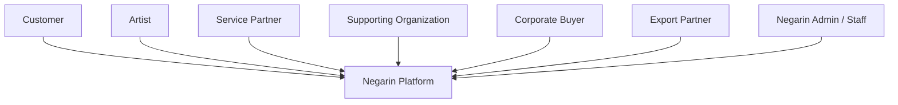

# System Context & Module Boundaries

Status: Accepted baseline.

## Context

Negarin is the orchestration and system-of-record layer between Customers, Artists, Service Partners, Supporting Organizations, Corporate Buyers, and Export Partners.

External roles do not receive direct database access or direct cross-role commercial channels.

## Bounded modules

### Identity
Owns:
- users
- credentials/session state
- OTP challenges
- role memberships
- organization memberships
- partner memberships

Does not own business permissions by itself.

### Artists
Owns:
- Artist identity/profile
- public/professional Artist data
- Artist-owned settings

### Products
Owns:
- Artist product
- Artist-set price
- product content/specifications
- availability/inventory where supported

### Publication Review
Owns:
- review submission
- content/image/specification review
- revision feedback
- publication permission

It does not own Artist pricing.

### Customer Commerce
Owns:
- customer-facing purchase context
- Customer Orders
- customer delivery/issue context

### Corporate Procurement
Owns:
- Purchase Request
- Proposal
- Corporate Order buyer-facing context

### Export Network
Owns:
- Export Eligibility context
- Export Publication Approval
- Market Availability
- localized Partner product presentation
- Partner commercial relationship context

### Orders & Allocations
Owns:
- canonical order identities
- ArtistAllocation records
- relationship between aggregate order and Artist execution

### Fulfillment
Owns:
- Artist execution progress
- preparation
- packaging
- shipment handoff/status where applicable

### Delivery
Owns:
- delivery references
- delivery status
- recipient confirmation context

### Issues
Owns:
- issue reports
- issue state
- evidence references
- resolution coordination

External roles report issues; Negarin coordinates resolution.

### Finance & Settlement
Owns:
- payment record
- protected-funds state
- settlement eligibility
- Artist settlement

It must keep Partner commercial transaction separate from Artist domestic settlement.

### Growth
Owns:
- Growth levels
- Growth history
- Growth evaluation outputs

Canonical levels:
- جوانه
- شکوفه
- سرو زرین
- سفیر جهانی

Growth cannot be purchased.

### Services
Owns:
- ServiceRequest
- ServiceAssignment
- execution status
- deliverables

Service Partner sees only assigned work.

### Supporting Organizations
Owns:
- SupportProgram
- ArtistReferral
- SupportRelationship
- MembershipSupport
- ServiceCreditAllocation / ServiceQuota
- SupportUsage

### Notifications
Owns delivery attempts and preferences, not business truth.

### Files
Owns file metadata and signed access.

### Reporting
Builds role-scoped read models. It does not bypass authorization.

### Audit
Records sensitive actions and security-relevant state changes.

## Dependency rule

Modules may depend on stable application interfaces/contracts. Direct cross-module database writes are prohibited.

A module that needs another module to change state issues an application command or domain event rather than updating that module's tables directly.
